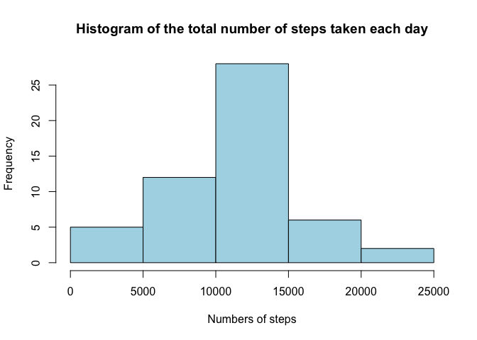
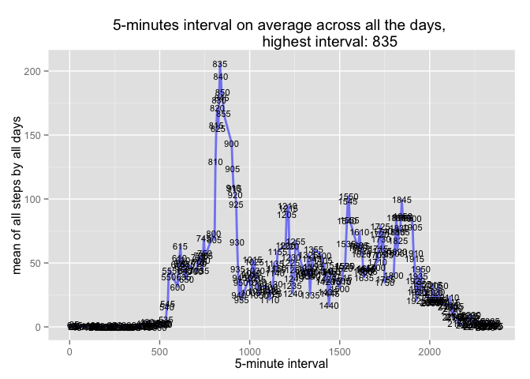
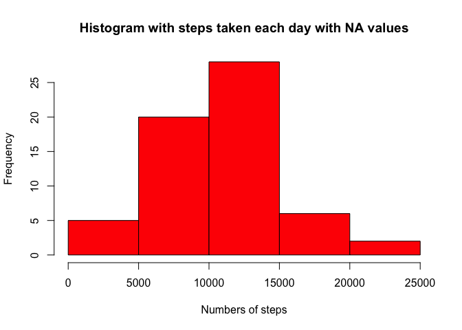
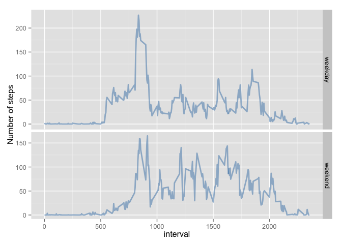

# PA1_template.Rmd
FAFA  
13 de marzo de 2015  

## Loading Libraries  


```r
library(datasets)  
library(ggplot2)   
library(lattice)  
library(plyr)  
library(xtable)  
Sys.setlocale(category="LC_TIME", locale="C")   
```

```
## [1] "C"
```

## Loading files with data (Loading Phase)  


```r
setwd("/Users/felixangelfernandezalonso/datasciencecoursera/researchreprodu/assessment1")  
fileUrl <- "https://d396qusza40orc.cloudfront.net/repdata%2Fdata%2Factivity.zip"  
download.file(fileUrl, destfile = "./activity.zip", method = "curl")  
datedownload <- date()  
unzip("activity.zip")  
```


##CLEANING DATA (preprocessing phase)  
Process/transform the data into a format suitable for your analysis  
load the files with NA and without NA values to process later


```r
## load the file and drop NA values from rows
activity <- na.omit(read.csv("./activity.csv", head=TRUE,sep=","))
## load the file with NA values
activityNA <- read.csv("./activity.csv", head=TRUE,sep=",")
## load the file with NA values to fill in with mean values later
activityNAmean <- read.csv("./activity.csv", head=TRUE,sep=",")
```


##CALCULATING RESULTS (results/plot phase)
QUESTION 1  
question 1: What is mean total number of steps taken per day?                    ##


```r
## Calculate the total number of steps taken per day
activitysteps <- aggregate(activity$steps, by=list(activity$date), sum)
colnames(activitysteps)[1] <- "date"
colnames(activitysteps)[2] <- "steps"

hist(activitysteps$steps, col = "lightblue",
     angle = 45, border = NULL,
     main = "Histogram of the total number of steps taken each day",
     xlab = "Numbers of steps",
     axes = TRUE)
```

 

```r
## Calculate mean and median of total number of steps taken by day and add two columns
## mean
activitystepsmean <- aggregate(activity$steps, by=list(activity$date), mean)
colnames(activitystepsmean)[1] <- "date"
colnames(activitystepsmean)[2] <- "mean"


activitystepsmedian <- aggregate(activity$steps, by=list(activity$date), median)
colnames(activitystepsmedian)[1] <- "date"
colnames(activitystepsmedian)[2] <- "median"

activitysteps <- merge(activitysteps,activitystepsmean, by = c("date"))
activitysteps <- merge(activitysteps,activitystepsmedian, by = c("date"))

t <-xtable(summary(activitysteps))
print(t, type = "html")
```

<!-- html table generated in R 3.1.2 by xtable 1.7-4 package -->
<!-- Sat Mar 14 11:20:23 2015 -->
<table border=1>
<tr> <th>  </th> <th>         date </th> <th>     steps </th> <th>      mean </th> <th>     median </th>  </tr>
  <tr> <td align="right"> 1 </td> <td> 2012-10-02: 1   </td> <td> Min.   :   41   </td> <td> Min.   : 0.1424   </td> <td> Min.   :0   </td> </tr>
  <tr> <td align="right"> 2 </td> <td> 2012-10-03: 1   </td> <td> 1st Qu.: 8841   </td> <td> 1st Qu.:30.6979   </td> <td> 1st Qu.:0   </td> </tr>
  <tr> <td align="right"> 3 </td> <td> 2012-10-04: 1   </td> <td> Median :10765   </td> <td> Median :37.3785   </td> <td> Median :0   </td> </tr>
  <tr> <td align="right"> 4 </td> <td> 2012-10-05: 1   </td> <td> Mean   :10766   </td> <td> Mean   :37.3826   </td> <td> Mean   :0   </td> </tr>
  <tr> <td align="right"> 5 </td> <td> 2012-10-06: 1   </td> <td> 3rd Qu.:13294   </td> <td> 3rd Qu.:46.1597   </td> <td> 3rd Qu.:0   </td> </tr>
  <tr> <td align="right"> 6 </td> <td> 2012-10-07: 1   </td> <td> Max.   :21194   </td> <td> Max.   :73.5903   </td> <td> Max.   :0   </td> </tr>
  <tr> <td align="right"> 7 </td> <td> (Other)   :47   </td> <td>  </td> <td>  </td> <td>  </td> </tr>
   </table>


## CALCULATING RESULTS (results/plot phase) 
QUESTION 2   
question 2: What is the average daily activity pattern?     


```r
## aggregate the data frame to summarize by 5 minutes interval and all days
activitytemp <- aggregate(activity$steps, by=list(activity$interval,activity$date), mean)
colnames(activitytemp)[1] <- "interval"
colnames(activitytemp)[2] <- "date"
colnames(activitytemp)[3] <- "mean"

activity5min <- aggregate(activitytemp$mean, by=list(activitytemp$interval), mean)
colnames(activity5min)[1] <- "interval"
colnames(activity5min)[2] <- "mean"

## obtain the max mean value and return the highest 5-minute interval  to plot in main title
maxinter <- activity5min$interval[which.max( activity5min$mean[] )]

graphic <- ggplot(activity5min, aes(interval, mean));

p <-graphic + geom_line(color = "blue", size = 1, alpha = 1/2) + 
    labs(title = paste("5-minutes interval on average across all the days, 
                       highest interval:", maxinter)) +
    geom_text(aes(label = interval), size = 3, color = "black") +
    ylab ("mean of all steps by all days") +
    xlab ("5-minute interval")

print(p);
```

 


## CALCULATING RESULTS (results/plot phase)
QUESTION 3   
question 3: Imputing missing values                                            


```r
## total number of rows with NA values.
TotalNA <- length(activityNA$steps) - length(activity$steps)

## mean by interval and date to calculate the mean of NA value and fill in
activityinter <- aggregate(activityNA$steps, by=list(activityNA$date,activityNA$interval), mean)
colnames(activityinter)[1] <- "date"
colnames(activityinter)[2] <- "interval"
colnames(activityinter)[3] <- "mean"

## replace every value of NA by 0 because later if not the mean would be NA
activityinter$mean[is.na(activityinter$mean)] <- 0
## data frame with the mean by 5 minute interval to use it later inside the loop
tempmean  <- round(aggregate(activityinter$mean, by=list(activityinter$interval), mean))
colnames(tempmean)[1] <- "interval"
colnames(tempmean)[2] <- "mean"

## replace NA values with the mean for that interval
for (i in 1:length(activityNA$steps))
{
    if (is.na(activityNA$steps[i]) == TRUE)
        {
            inter <- activityNA$interval[i]
            ## fill in the NA values with mean of the 5 minute interval
            activityNAmean$steps[i] <- tempmean$mean[tempmean$interval == inter]
        }
}

## aggregate by total number of steps taken each day
activitystepsNA <- aggregate(activityNAmean$steps, by=list(activityNAmean$date), sum)
colnames(activitystepsNA)[1] <- "date"
colnames(activitystepsNA)[2] <- "steps"


hist(activitystepsNA$steps, col = "red",
     angle = 45, border = NULL,
     main = "Histogram with steps taken each day with NA values",
     xlab = "Numbers of steps",
     axes = TRUE)
```

 

```r
## Calculate mean and median of total number of steps taken by day with NA and add two columns
## mean
activitystepsmeanNA <- aggregate(activityNAmean$steps, by=list(activityNAmean$date), mean)
colnames(activitystepsmeanNA)[1] <- "date"
colnames(activitystepsmeanNA)[2] <- "mean"

activitystepsmedianNA <- aggregate(activityNAmean$steps, by=list(activityNAmean$date), median)
colnames(activitystepsmedianNA)[1] <- "date"
colnames(activitystepsmedianNA)[2] <- "median"

activitystepsNA <- merge(activitystepsNA,activitystepsmeanNA, by = c("date"))
activitystepsNA <- merge(activitystepsNA,activitystepsmedianNA, by = c("date"))

t <-xtable(summary(activitystepsNA))
print(t, type = "html")
```

<!-- html table generated in R 3.1.2 by xtable 1.7-4 package -->
<!-- Sat Mar 14 11:20:25 2015 -->
<table border=1>
<tr> <th>  </th> <th>         date </th> <th>     steps </th> <th>      mean </th> <th>     median </th>  </tr>
  <tr> <td align="right"> 1 </td> <td> 2012-10-01: 1   </td> <td> Min.   :   41   </td> <td> Min.   : 0.1424   </td> <td> Min.   : 0.000   </td> </tr>
  <tr> <td align="right"> 2 </td> <td> 2012-10-02: 1   </td> <td> 1st Qu.: 9352   </td> <td> 1st Qu.:32.4722   </td> <td> 1st Qu.: 0.000   </td> </tr>
  <tr> <td align="right"> 3 </td> <td> 2012-10-03: 1   </td> <td> Median :10395   </td> <td> Median :36.0938   </td> <td> Median : 0.000   </td> </tr>
  <tr> <td align="right"> 4 </td> <td> 2012-10-04: 1   </td> <td> Mean   :10581   </td> <td> Mean   :36.7386   </td> <td> Mean   : 3.869   </td> </tr>
  <tr> <td align="right"> 5 </td> <td> 2012-10-05: 1   </td> <td> 3rd Qu.:12811   </td> <td> 3rd Qu.:44.4826   </td> <td> 3rd Qu.: 0.000   </td> </tr>
  <tr> <td align="right"> 6 </td> <td> 2012-10-06: 1   </td> <td> Max.   :21194   </td> <td> Max.   :73.5903   </td> <td> Max.   :29.500   </td> </tr>
  <tr> <td align="right"> 7 </td> <td> (Other)   :55   </td> <td>  </td> <td>  </td> <td>  </td> </tr>
   </table>

## CALCULATING RESULTS (results/plot phase)  
QUESTION 4   
question 4: Are there differences in activity patterns between weekdays and weekends?                                                             


```r
## add a column with wth the days of the date, and then convert to an specific value
## like weekday and weekend.
activityNAmean$wkd <- weekdays(as.Date(activityNAmean$date))

## replace value with name of the day with "weekday" or "weekend"
week <- c("Monday", "Tuesday", "Wednesday","Thursday","Friday")
weekend <- c("Saturday","Sunday")
activityNAmean$wkd[activityNAmean$wkd %in% weekend] <- "weekend"
activityNAmean$wkd[activityNAmean$wkd %in% week] <- "weekday"

## agregate by two values of column wkd
activitywkd <- aggregate(activityNAmean$steps, by=list(activityNAmean$interval,activityNAmean$wkd), mean)
colnames(activitywkd)[1] <- "interval"
colnames(activitywkd)[2] <- "wkd"
colnames(activitywkd)[3] <- "mean"

graphic <- ggplot(activitywkd, aes(interval, mean));

p <- graphic + geom_line(color = "steelblue", size = 1, alpha = 1/2) + 
    facet_grid(wkd ~ ., scales = "free", space = "free") +
    ylab ("Number of steps") +
    xlab ("interval");

print(p);
```

 

